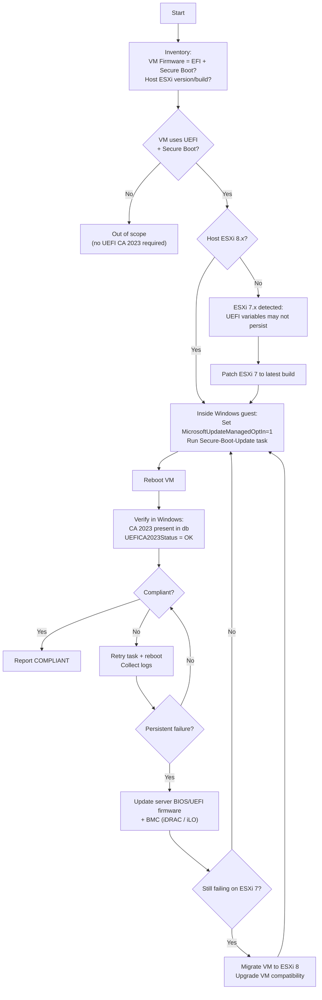

# Secure Boot Certificate Management (2011 → 2023) — VMware + Windows Playbook

> TL;DR (TH): ใบรับรอง Secure Boot ชุดเก่า (2011) จะเริ่มหมดอายุช่วง **Jun 2026**  
> ต้องทำให้ Windows ติดตั้ง/อัพเดทไปใช้ **Windows UEFI CA 2023** ให้ครบ โดยเฉพาะ VM บน **ESXi 7** ที่มักมีปัญหาเขียน UEFI variables

## Background

Microsoft Secure Boot certificates originally issued in **2011** will begin expiring in **June 2026**.  
Organizations should ensure the **2023 Secure Boot certificates** are deployed across Windows systems (physical and virtual) to continue receiving boot-related security updates.

This repository is an **operational runbook** for environments running **Windows VMs on VMware ESXi 7/8**.

## Scope / Audience

- Windows workloads running with **UEFI + Secure Boot** (primary scope)
- Linux workloads running with **UEFI + Secure Boot** (impact notes + verification guidance included)
- VMware vSphere / ESXi **7.x and 8.x**
- Operators using:
  - PowerShell / PowerCLI
  - Optional: VMware Tools guest operations (agentless execution)

## Key Notes (Read First)

- **Windows performs the certificate updates internally.** vCenter does not “push” Secure Boot certs directly.
- **ESXi 8** generally supports Secure Boot variable updates correctly.
- **ESXi 7** may block UEFI variable writes → updates can fail or not persist.
- Plan for **controlled reboots** and avoid rebooting critical tiers in the same batch.
- Take **snapshots/checkpoints** where appropriate before rollout.

## ESXi Host BIOS/UEFI Firmware — Do we need to update it?

**Usually: no hard requirement.** The Microsoft Secure Boot certificate update (UEFI CA 2023) happens **inside Windows** and updates **the guest firmware variables (db/KEK/dbx) presented to the VM**, not the physical ESXi host’s BIOS keys.

**However: it’s recommended to be on a current vendor firmware when you have ESXi 7 Secure Boot variable issues.** Many “UEFI variable write / NVRAM persistence” problems (seen as updates not sticking after reboot) can be influenced by:
- ESXi build/patch level
- ESXi major version (7 vs 8)
- System BIOS/UEFI firmware bugs (vendor-specific)

### Practical guidance
- If your Windows VM update/verification passes on ESXi 8, **you don’t need a BIOS update just because of the cert rollout**.
- If you are staying on **ESXi 7** and see failures / non-persistent updates, prioritize in this order:
  1. **Update ESXi to latest patch** within 7.x
  2. **Update server BIOS/UEFI firmware** to the latest vendor-supported release (plus iDRAC/iLO/BMC if applicable)
  3. Move affected workloads to **ESXi 8** (best fix in many environments)

### What to document in change records
- ESXi version/build before/after
- Server model + BIOS/UEFI firmware version before/after
- Whether host is booting via UEFI (and whether ESXi Secure Boot is enabled)

### Can we view the host BIOS Secure Boot certificates (PK/KEK/db/dbx)?
- **Not in a standard, portable way from ESXi/vCenter.** ESXi can report **whether Secure Boot is enabled**, but it typically does **not provide a supported command/API to dump the platform key databases** (PK/KEK/db/dbx) from the server firmware.
- If you must audit BIOS-level Secure Boot keys, use the **server vendor tooling/UI**:
  - Dell: iDRAC / Lifecycle Controller (or `racadm`)
  - HPE: iLO / Intelligent Provisioning
  - Lenovo: XCC
  - Or directly in the **BIOS/UEFI setup** screens

**Operationally:** for this Microsoft UEFI CA 2023 rollout, tracking **(a) BIOS/UEFI firmware version** and **(b) Secure Boot enabled/disabled** on the ESXi host is usually sufficient.

### FAQ — What if the host is still “2011” but the VM/Windows is already “2023”?

This question comes up a lot because there are **two different Secure Boot worlds**:
- **Host firmware Secure Boot keys** (physical server BIOS/UEFI PK/KEK/db/dbx)
- **Guest/VM Secure Boot variables** (what Windows updates inside the VM)

**For VMware Windows VMs:**
- If Windows/VM already has **Windows UEFI CA 2023** present/verified, but the **physical ESXi host firmware still has older (2011-era) keys**, it is **usually fine**.
- The VM boot trust chain is validated against the **VM’s Secure Boot variables**, not the host’s BIOS key database.

**Where problems usually happen:**
- When updates **do not persist** after reboot on **ESXi 7** (UEFI variable write/NVRAM persistence issues). In that case, the fix is typically **ESXi patching / firmware updates / migrate to ESXi 8**, not “install CA 2023 into host BIOS”.

**For physical OS booting directly on hardware (non-VM):**
- If the OS/bootloader chain requires **2023** but firmware only trusts **2011**, you can hit **Secure Boot verification failures** (won’t boot with Secure Boot on). This is vendor/OS-specific.

**Bottom line:**
- For this runbook scope (Windows VMs on ESXi), treat “host BIOS keys still 2011” as **not the primary risk**.
- Treat **ESXi 7 + UEFI variable persistence** as the primary risk; mitigate via **patching and/or ESXi 8**.

## High-Level Strategy

### Flowchart (operator view)

> Note: Some Markdown viewers don’t render Mermaid. The ASCII flow below is the source of truth.

```text
[Start]
   |
   v
[Inventory]
- VM: Firmware=EFI? Secure Boot enabled?
- Host: ESXi version/build
   |
   v
{VM uses UEFI + Secure Boot?}
   |-- No --> [Out of scope (no UEFI CA 2023 rollout needed)]
   |
   `-- Yes --> {Host is ESXi 8.x?}
               |-- Yes --> [Inside Windows guest]
               |           - Opt-in MicrosoftUpdateManagedOptIn=1
               |           - Run Scheduled Task: \Microsoft\Windows\PI\Secure-Boot-Update
               |           - Reboot
               |           - Verify: CA 2023 in db + UEFICA2023Status OK
               |           - Report COMPLIANT
               |
               `-- No (ESXi 7.x) --> [Higher risk: UEFI variables may not persist]
                                     - Patch ESXi 7 to latest build
                                     - Retry Windows guest steps
                                     - If still failing: update server BIOS/UEFI firmware + BMC
                                     - If still failing: migrate to ESXi 8 + upgrade VM compatibility

Failure path (anywhere verification fails):
- Retry task + reboot
- Collect evidence (status, logs)
- Escalate per remediation list above
```

#### Mermaid (optional)

If your viewer supports Mermaid:



### Checklist

1. Inventory VMs (Secure Boot state + ESXi version)
2. Prioritize **ESXi 7** workloads for migration to **ESXi 8** where possible
3. Enable Microsoft-managed Secure Boot updates (inside Windows)
4. Trigger the Secure Boot update scheduled task
5. Reboot
6. Verify certificates
7. Report compliance

---

## Linux VMs — Impact & verification (UEFI + Secure Boot)

### Will Linux VMs be impacted?

**Possibly, but the failure mode is different from Windows.** The Windows UEFI CA 2023 rollout described in this runbook is Windows-specific, but Linux VMs that boot with **UEFI + Secure Boot** can be impacted by:

- **dbx (revocation list) updates**: firmware/dbx updates can revoke older vulnerable bootloaders.
- **Old shim/GRUB signatures**: if your distro uses an older **shim** that gets revoked, Secure Boot may block boot.
- **SBAT enforcement**: newer ecosystems rely on SBAT metadata to allow granular revocations; older shim builds without proper SBAT can be blocked in some scenarios.

**Typical symptoms when impacted**
- VM stops booting with Secure Boot enabled (bootloader verification failure)
- Requires temporarily disabling Secure Boot to recover (then update shim/grub/kernel)

### Recommended approach
- Keep Linux VMs on vendor-supported versions and apply security updates regularly.
- Before any broad Secure Boot/dbx enforcement changes, test on a non-critical Linux VM.

### Quick verification (inside Linux)

> Commands vary by distro; examples below are generic.

- Confirm boot mode / Secure Boot state (when available):
  - `mokutil --sb-state` (needs `mokutil` installed)
- Check enrolled keys/MOKs (optional):
  - `mokutil --list-enrolled`

If `mokutil` is unavailable, check distro docs for Secure Boot verification steps.

---

## Step 1 — Inventory via PowerCLI

```powershell
Get-VM | Select Name,
@{N="SecureBoot";E={$_.ExtensionData.Config.BootOptions.EfiSecureBootEnabled}},
@{N="ESXi";E={$_.VMHost.Version}} |
Export-Csv secureboot_inventory.csv -NoTypeInformation
```

**Output:** `secureboot_inventory.csv`

---

## Step 2 — Opt-in to Microsoft-managed Secure Boot updates (inside Windows)

```powershell
reg add HKLM\SYSTEM\CurrentControlSet\Control\SecureBoot /v MicrosoftUpdateManagedOptIn /t REG_DWORD /d 1 /f
Start-ScheduledTask -TaskName "\Microsoft\Windows\PI\Secure-Boot-Update"
```

Reboot after completion.

---

## Step 3 — Verification (inside Windows)

### Confirm Secure Boot is enabled

```powershell
Confirm-SecureBootUEFI
```

### Confirm Windows UEFI CA 2023 is present in DB

```powershell
[System.Text.Encoding]::ASCII.GetString((Get-SecureBootUEFI db).bytes) -match "Windows UEFI CA 2023"
```

### Check servicing status

```powershell
Get-ItemProperty -Path HKLM:\SYSTEM\CurrentControlSet\Control\SecureBoot\Servicing -Name UEFICA2023Status
```

**Expected (typical):**
- SecureBoot = `True`
- `UEFICA2023Status = 1`

---

## ESXi 7 Remediation Guidance

### Recommended

1. Migrate VM to **ESXi 8**
2. Upgrade VM hardware compatibility
3. Retry certificate update

### Fallback

1. Power off VM
2. Disable Secure Boot
3. Boot
4. Patch Windows
5. Re-enable Secure Boot
6. Reboot

### Last resort

- Rebuild VM on ESXi 8

---

## Optional — VMware Tools Automation (Agentless)

Use when SCCM / Intune / GPO are unavailable.  
PowerCLI uses VMware Tools to execute commands inside the guest OS.

### Requirements

- VMware Tools running
- Guest admin credential
- VM powered on

> No WinRM or network access required.

### Example — Single VM test

```powershell
Invoke-VMScript -VM VM01 `
-ScriptText "hostname" `
-GuestCredential (Get-Credential)
```

### Example — Batch Secure Boot update via VMware Tools

```powershell
$cred = Get-Credential

Get-VM | Where {$_.PowerState -eq "PoweredOn"} | Select -First 50 |
ForEach-Object {
  Invoke-VMScript -VM $_ -GuestCredential $cred -ScriptText '
    reg add HKLM\SYSTEM\CurrentControlSet\Control\SecureBoot /v MicrosoftUpdateManagedOptIn /t REG_DWORD /d 1 /f
    Start-ScheduledTask -TaskName "\\Microsoft\\Windows\\PI\\Secure-Boot-Update"
    shutdown /r /t 60
  '
}
```

**Best practice**
- Batch 25–50 VMs
- Stagger reboots by tier/criticality
- Log success/failure per VM

---

## Compliance Script Example (inside Windows)

```powershell
$result = [System.Text.Encoding]::ASCII.GetString((Get-SecureBootUEFI db).bytes)

if ($result -match "Windows UEFI CA 2023") {
  "COMPLIANT"
} else {
  "NON-COMPLIANT"
}
```

---

## Timeline (High level)

- **June 2026** – KEK / UEFI CA 2011 expires
- **Oct 2026** – Windows Production PCA expires

Systems not updated may stop receiving boot-level security fixes.

---

## Change Log

- 2026-02-07: README formatting improvements + added TH TL;DR, scope, outputs, and ESXi7 caveats

## References (starting points)

> Note: In this OpenClaw environment I currently can’t use automated web search (Brave API key missing) and browser automation is unavailable, so I can’t guarantee these are the newest URLs. These are **good starting points**; if you paste your organization’s official link set, I can pin exact “latest” docs.

### Microsoft
- Search terms (use with your preferred search engine):
  - `Windows UEFI CA 2023 Secure Boot`
  - `Secure Boot certificate update June 2026`
  - `UEFICA2023Status`
  - `MicrosoftUpdateManagedOptIn SecureBoot`

### VMware
- Search terms:
  - `ESXi 7 UEFI variable write Secure Boot`
  - `ESXi Secure Boot virtual machine UEFI variables`

### Linux Secure Boot (shim/GRUB/SBAT)
- Search terms:
  - `shim SBAT revocation dbx`
  - `mokutil sb-state`
  - `<distro> secure boot shim update`

## License

Add a license if you plan to share this broadly (e.g., MIT).
