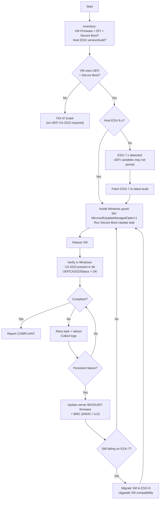

# Flowcharts

## ASCII flow (portable)

```text
[Start]
   |
   v
[Inventory]
- VM: Firmware=EFI? Secure Boot enabled?
- Host: ESXi version/build
   |
   v
{VM uses UEFI + Secure Boot?}
   |-- No --> [Out of scope (no UEFI CA 2023 rollout needed)]
   |
   `-- Yes --> {Host is ESXi 8.x?}
               |-- Yes --> [Inside Windows guest]
               |           - Opt-in MicrosoftUpdateManagedOptIn=1
               |           - Run Scheduled Task: \Microsoft\Windows\PI\Secure-Boot-Update
               |           - Reboot
               |           - Verify: CA 2023 in db + UEFICA2023Status OK
               |           - Report COMPLIANT
               |
               `-- No (ESXi 7.x) --> [Higher risk: UEFI variables may not persist]
                                     - Patch ESXi 7 to latest build
                                     - Retry Windows guest steps
                                     - If still failing: update server BIOS/UEFI firmware + BMC
                                     - If still failing: migrate to ESXi 8 + upgrade VM compatibility

Failure path (anywhere verification fails):
- Retry task + reboot
- Collect evidence (status, logs)
- Escalate per remediation list above
```

## Mermaid (optional)


