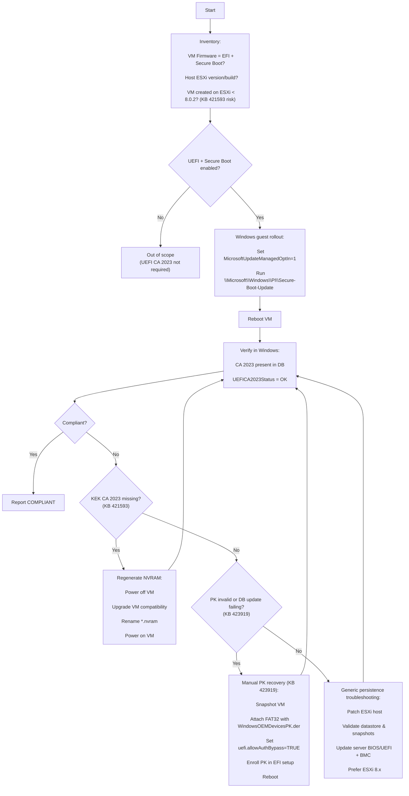

# Flowcharts

## ASCII flow (portable)

```text
[Start]
   |
   v
[Inventory]
- VM: Firmware=EFI? Secure Boot enabled?
- Host: ESXi version/build
- VM origin/age: was the VM created on ESXi < 8.0.2? (KB 421593 risk)
   |
   v
{VM uses UEFI + Secure Boot?}
   |-- No --> [Out of scope (no UEFI CA 2023 rollout needed)]
   |
   `-- Yes --> [Run Windows guest rollout]
               - Set MicrosoftUpdateManagedOptIn=1
               - Run Scheduled Task: \Microsoft\Windows\PI\Secure-Boot-Update
               - Reboot
               - Verify: CA 2023 present + UEFICA2023Status OK
                         |
                         v
                   {Compliant?}
                     |-- Yes --> [Report COMPLIANT]
                     |
                     `-- No --> {Is KEK CA 2023 missing? (KB 421593)}
                                |-- Yes --> [Regenerate VM NVRAM]
                                |           - Power off
                                |           - Upgrade VM compatibility
                                |           - Rename *.nvram (backup)
                                |           - Power on (regen)
                                |           - Re-verify
                                |
                                `-- No --> {PK invalid / secure boot DB updates failing? (KB 423919)}
                                           |-- Yes --> [Manual PK update]
                                           |           - Snapshot
                                           |           - Attach FAT32 disk w/ WindowsOEMDevicesPK.der
                                           |           - Set uefi.allowAuthBypass="TRUE"
                                           |           - Enroll PK in EFI setup
                                           |           - Remove bypass + detach disk
                                           |           - Reboot + re-verify
                                           |
                                           `-- No --> [Generic persistence troubleshooting]
                                                      - Patch ESXi to latest build
                                                      - Validate datastore health/free space/snapshot chain
                                                      - Update server BIOS/UEFI firmware + BMC
                                                      - Prefer ESXi 8 for affected workloads

Notes:
- ESXi 7 has higher risk of UEFI variable persistence issues.
- ESXi 8 reduces risk but is not a guarantee (KB 421593/423919 cover ESXi 8 scenarios).
```

## Mermaid (optional)


