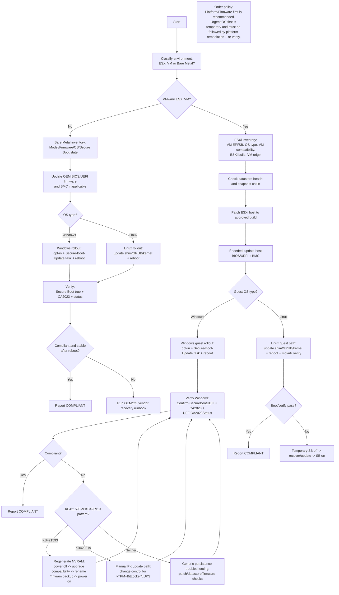

# Flowcharts

## ASCII flow (portable)

```text
[Start]
   |
   v
[Classify environment]
- Is workload VMware VM on ESXi?
- Or Bare Metal / non-VMware?
   |
   v
{VMware ESXi VM?}
   |-- No --> [Bare Metal path]
   |           1) Inventory machine + firmware + OS + Secure Boot state
   |           2) Update OEM BIOS/UEFI firmware (+ BMC if applicable)
   |           3) OS rollout (Windows: opt-in+task / Linux: shim-grub-kernel update)
   |           4) Reboot + verify
   |                    |
   |                    v
   |              {Compliant and stable after reboot?}
   |                 |-- Yes --> [Report COMPLIANT]
   |                 `-- No --> [Run OEM/OS vendor recovery runbook]
   |
   `-- Yes --> [ESXi VM path]
               1) Inventory host+VM (EFI, Secure Boot, OS type, VM compatibility, ESXi build)
               2) Check datastore health/snapshot chain
               3) Patch ESXi host to approved build
               4) If needed, update host BIOS/UEFI + BMC
               5) Guest rollout
                         |
                         v
                   {Guest OS type?}
                     |-- Windows --> [Set opt-in + run Secure-Boot-Update + reboot]
                     |               -> Verify: Confirm-SecureBootUEFI + CA2023 in db + UEFICA2023Status
                     |                        |
                     |                        v
                     |                  {Compliant?}
                     |                    |-- Yes --> [Report COMPLIANT]
                     |                    `-- No --> {KB pattern?}
                     |                               |-- KB421593 --> [Regenerate NVRAM]
                     |                               |                 Power off -> upgrade VM compatibility -> rename *.nvram backup -> power on
                     |                               |
                     |                               `-- KB423919 --> [Manual PK update path]
                     |                                                 (change control for vTPM + BitLocker/LUKS)
                     |                               |
                     |                               `-- Neither --> [Generic persistence troubleshooting]
                     |                                                 patch/datastore/firmware checks then re-verify
                     |
                     `-- Linux --> [Update shim/GRUB/kernel + reboot + verify mokutil]
                                   -> if boot fails: temporary SB off -> recover -> SB on

Reference checklist:
- docs/12-update-checklist-baremetal-esxi.md

Order policy:
- Recommended: Platform/Firmware first -> OS rollout -> Verify
- Exception: urgent OS security can use temporary OS-first, then complete platform remediation and re-verify
```

## Mermaid


```mermaid
flowchart TD
  A[Start] --> B["Classify environment:<br/>ESXi VM or Bare Metal?"]

  B --> C{"VMware ESXi VM?"}

  C -- No --> BM1["Bare Metal inventory:<br/>Model/Firmware/OS/Secure Boot state"]
  BM1 --> BM2["Update OEM BIOS/UEFI firmware<br/>and BMC if applicable"]
  BM2 --> BM3{"OS type?"}
  BM3 -- Windows --> BMW["Windows rollout:<br/>opt-in + Secure-Boot-Update task + reboot"]
  BM3 -- Linux --> BML["Linux rollout:<br/>update shim/GRUB/kernel + reboot"]
  BMW --> BMV["Verify:<br/>Secure Boot true + CA2023 + status"]
  BML --> BMV
  BMV --> BMC{"Compliant and stable<br/>after reboot?"}
  BMC -- Yes --> DONE1[Report COMPLIANT]
  BMC -- No --> BMREC["Run OEM/OS vendor recovery runbook"]

  C -- Yes --> VM1["ESXi inventory:<br/>VM EFI/SB, OS type, VM compatibility,<br/>ESXi build, VM origin"]
  VM1 --> VM2["Check datastore health and snapshot chain"]
  VM2 --> VM3["Patch ESXi host to approved build"]
  VM3 --> VM4["If needed: update host BIOS/UEFI + BMC"]
  VM4 --> VMOS{"Guest OS type?"}

  VMOS -- Windows --> VW1["Windows guest rollout:<br/>opt-in + Secure-Boot-Update task + reboot"]
  VW1 --> VWV["Verify Windows:<br/>Confirm-SecureBootUEFI + CA2023 + UEFICA2023Status"]
  VWV --> VWC{"Compliant?"}
  VWC -- Yes --> DONE2[Report COMPLIANT]
  VWC -- No --> KBQ{"KB421593 or KB423919 pattern?"}

  KBQ -- KB421593 --> KB1["Regenerate NVRAM:<br/>power off -> upgrade compatibility -> rename *.nvram backup -> power on"]
  KB1 --> VWV
  KBQ -- KB423919 --> KB2["Manual PK update path:<br/>change control for vTPM+BitLocker/LUKS"]
  KB2 --> VWV
  KBQ -- Neither --> KB3["Generic persistence troubleshooting:<br/>patch/datastore/firmware checks"]
  KB3 --> VWV

  VMOS -- Linux --> VL1["Linux guest path:<br/>update shim/GRUB/kernel + reboot + mokutil verify"]
  VL1 --> VL2{"Boot/verify pass?"}
  VL2 -- Yes --> DONE3[Report COMPLIANT]
  VL2 -- No --> VL3["Temporary SB off -> recover/update -> SB on"]

  NOTE["Order policy:<br/>Platform/Firmware first is recommended.<br/>Urgent OS-first is temporary and must be followed by platform remediation + re-verify."]
```
